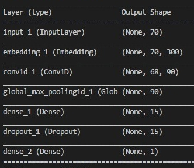
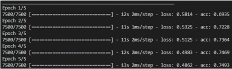

## Introdução
Esta é a implementação do artigo [Classificação de Linguagem Natural com Redes Convolucionais] ()


## Requisitos
Baixe as dependências necessárias para execução da rede neural convolucional.

* python 3
* Keras
* Pandas
* Numpy
* Sckit
* scikit-learn


## Datasets
Agora baixe os Datasets necessários para o treinamento e a avaliação.

### Para Treinamento
* [wiki-news-300d-1M.vec.zip](https://s3-us-west-1.amazonaws.com/fasttext-vectors/wiki-news-300d-1M.vec.zip)

### Para Teste
* [corpus](https://gist.github.com/kunalj101/ad1d9c58d338e20d09ff26bcc06c4235)


## Ajustando

Agora altere  os endereços de entrada dos datasets no codigo fonte ''cnn.py'' para os endereços correspondentes  em seu repositório. Sendo o primeiro  dataset de teste  e o segundo de treinamento.

* 1 - open('Dataset teste', encoding="utf8")
* 2 - open('Dataset Treino', encoding="utf8")


## Teste e Resultado da CNN

Após  ter todas as dependências e configurado os Datasets podemos executar a Rede Convolucional da seguinte forma:

```
python cnn.py
```

A execução carregará os Datasets e formara a rede, em seguida apresentará  os procedimentos de testes em 5 épocas de execução.



Com esta configuração obtém-se  resultados na taxa de acerto da rede de 74% conforme visto na figura seguinte.



